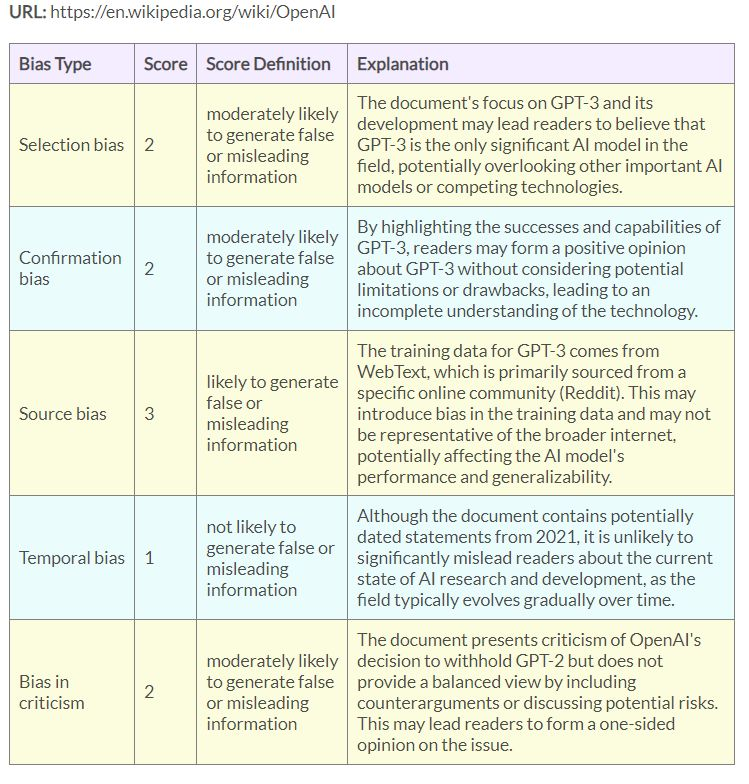

    <h2>
        URL Bias Check w/ Structured Output
    </h2>
    
 Created by Martin Zirulnik: <a class="text-link" href="https://mziru.com" target="_blank">https://mziru.com</a>

    
 Follow this link for more LLM projects: <a class="text-link" href="https://mziru.com/#blog" target="_blank">https://mziru.com/#blog</a>

     
     

        This is a repo for a lightweight app, powered by GPT-4, that leverages Langchain to
    <ol>
      <li>identify potential sources of bias in unstructured text loaded from URLs,</li>
      <li>evaluate these based on how likely each one is to produce false, misleading, or inaccurate information, </li>
      <li>output a structured dataset containing the results</li>
  </ol>
      

          <b>Note</b>: This currently supports HTML documents, including webpages that require JavaScript to render. Response times vary depending on traffic
          to OpenAI's servers.
      

      

        Local installation instructions (requires an OpenAI API key with access to GPT-4):
    </h4>
    <ol>
        <li>Clone this repo to a local environment</li>
        <li>Install dependencies listed in 'requirements.txt'</li>
        <li>Create new text files named 'openai_key.txt', containing your OpenAI API key</li>
        <li>Run 'main.py'</li>
    </ol>
    </h3>
    
Here's some curious output for the Wikipedia page on OpenAI: a slippery sort of recursion happens when the language model evaluates "source bias" in language that describes language used to train an earlier version of the model:

    
